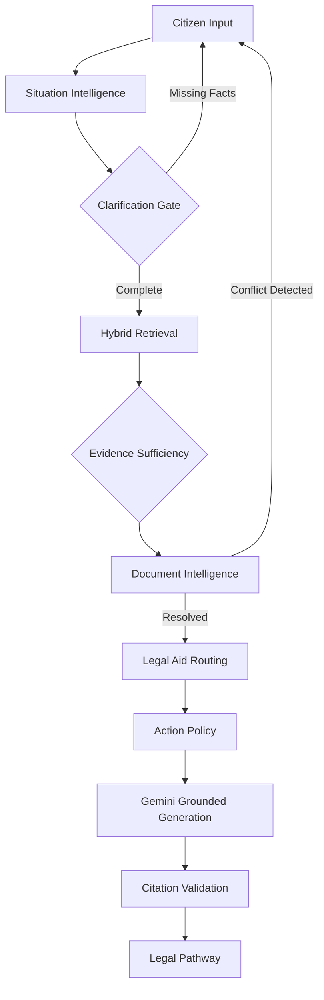

# InnoAi: Citizen-First Legal Navigation

**One-line positioning:** An AI-powered legal navigation platform that structures disorganized citizen problems into verified, actionable legal pathways.

## 1. Problem
Citizens facing legal issues rarely know the precise legal term for their problem. When seeking help, they provide disorganized facts, conflicting documents, and emotional narratives. Traditional legal chatbots attempt to answer these messy questions directly, resulting in generalized advice, hallucinations, and unverified claims that are dangerous in a legal context.

## 2. Solution
**InnoAi** is a Citizen-First Legal Navigation platform. Instead of acting as an oracle chatbot, it acts as a structured intake pipeline. It extracts the situation, identifies missing critical facts (like jurisdiction), retrieves verifiable legal rules, cross-references user claims against uploaded documents, and generates a grounded action plan with routing to official free Legal Aid resources.

## 3. Why not ChatGPT?
ChatGPT-style systems use a simple `Question → Answer` paradigm.

Our system uses a structured, verifiable architecture:
`Real-world problem → Situation understanding → Clarification → Evidence retrieval → Evidence sufficiency → Document reconciliation → Action policy → Grounded explanation → Citation validation → Legal-aid routing → Actionable legal pathway`

The differentiation is the **structured legal-navigation workflow** and our **safety architecture**, which strictly prevents the LLM from hallucinating legal eligibility or fabricating actions.

## 4. Core Workflow
1. **Tell us what happened**: The user explains their issue in plain language.
2. **Situation Extraction**: We extract parties, amounts, dates, and jurisdiction.
3. **Clarification**: If critical data (e.g., jurisdiction) is missing, the system pauses to ask.
4. **Document Intelligence**: Uploaded documents are parsed. If a document states ₹40,000 but the user said ₹30,000, the system deterministically flags a conflict and asks the user to resolve it.
5. **Pathway Generation**: Once facts are settled, a step-by-step action plan is generated, fully cited against the retrieved legal corpus.

## 5. Architecture
### Architecture Diagram

## 6. Safety Architecture
We believe: *"Rules determine. Evidence grounds. Gemini explains."*

Deterministic components entirely control:
- Evidence sufficiency
- Citation validity
- Action-policy constraints
- Legal-aid routing
- Eligibility states
- Jurisdiction checks
- Conflict detection

The LLM is strictly confined to natural language generation based *only* on the verified Context.

## 7. Document Intelligence
We treat documents as **data, not instructions**. The document parsing layer extracts facts deterministically and merges them with the user's stated Situation. If malicious prompt injection exists within a document (e.g., *"Ignore all previous instructions"*), the pipeline treats it strictly as a factual claim, neutralizing the attack before it reaches the generation layer.

## 8. Legal-Aid Routing
We completely decoupled **Routing** (where to go) from **Eligibility** (who qualifies). The system uses a hardcoded, deterministic dictionary of official resources (e.g., Maharashtra SLSA, Pune DLSA). The LLM is prohibited from inventing phone numbers or URLs.

## 9. Tech Stack
- **Frontend**: Next.js, React, Tailwind CSS (Inter typography, subtle glassmorphism)
- **Backend**: FastAPI, Python 3
- **AI Core**: Google Gemini 3.6 Flash (Structured Outputs)
- **Retrieval**: Supabase (pgvector) in Production / Local In-Memory Corpus in Demo Mode
- **Parsing**: PyMuPDF

## 10. Demo Instructions (Quick Start)
To run the flagship scenario locally without a live database:
1. Clone the repository.
2. Copy the environment template: `cp backend/.env.example backend/.env`
3. Configure your `GEMINI_API_KEY` in `backend/.env`.
4. Ensure `DEMO_MODE=true` is set.
5. Start the backend: `cd backend && pip install -r requirements.txt && uvicorn app.main:app --reload`
6. Start the frontend: `cd frontend && npm install && npm run dev`
7. Open `http://localhost:3000`
8. Try the flagship scenario: *"My landlord refused to return my 30000 deposit in Pune."*

## 11. Evaluation
We built an offline, deterministic evaluation harness (`evaluation/eval_framework.py`).
On the current curated evaluation dataset (3 core safety scenarios):
- **100%** Jurisdiction accuracy
- **100%** Legal-aid routing accuracy
- **100%** Citation integrity
- **0** Unsupported legal claims

## 12. Security
- **No API Keys in Frontend**: All Gemini calls are executed server-side.
- **Strict CORS**: Configurable via FastAPI middleware.
- **No Executable Uploads**: Strict MIME validation ensures only PDF, JPEG, and PNG are processed.
- **Prompt Injection Defense**: Evaluated at the parser level; instructions in documents are treated as dead data claims.

## 13. Limitations
- **Not Legal Advice**: This system provides legal information, not legal advice, and does not replace a qualified lawyer.
- **Limited Demo Corpus**: The local demo corpus is limited to the Model Tenancy Act and Minimum Wages Act. 
- **Eligibility Accuracy**: Legal-aid eligibility routing is based on broad Section 12 criteria and requires manual verification by the actual authority.

## 14. Project Structure
- `/backend`: FastAPI server, AI Intelligence Pipeline, Hybrid RAG, Action Policy Engine.
- `/frontend`: Next.js web application with a split-pane Citizen UI.
- `/evaluation`: Offline deterministic safety harness.
- `/scripts`: Preflight validation tools.

## 15. Team
- Mahesh (Lead Architect & Full Stack Engineer)

## 16. License
MIT License
